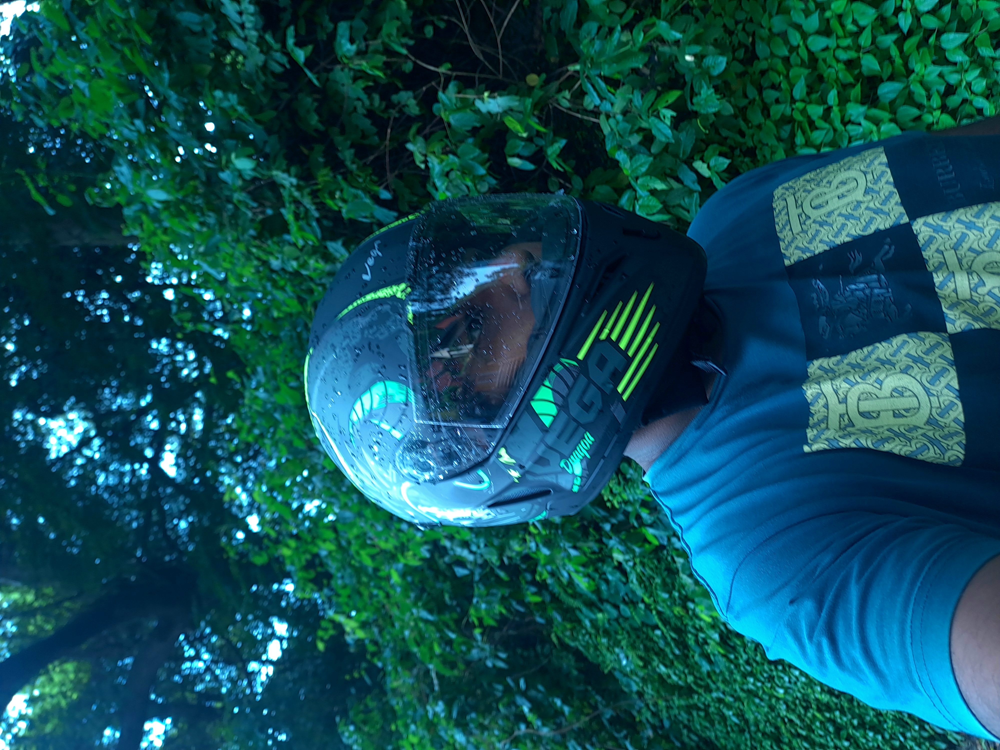

# 👋 Hey, I'm Sergio Fernandes!

## 🚀 Raw Optimism Meets Emo Energy

Welcome to my corner of the web! I'm a hyperactive, raw, and optimistic soul with a dash of emo, currently studying in 12th grade at DBHSS, Goa. My ambition? To become a Software/AI Engineer by pur[...]

### 🎓 The Journey So Far
- **Top performer** in Computer Science & Web Development at school.
- Scored a stellar **98.33% in IT/IT-es practicals** in grades 9 & **10**.
- One of only **2 students** (out of 60!) to not only pass but also to sort of ace the Python written exam.
- Passionate coder, always hungry to learn & build.

### 💡 Entrepreneurial Spirit
I'm the founder of [Fuelerz](https://github.com/goafuel/Fuelerz) — my startup that's all about fueling creativity and innovation.  
Check out our website, hosted right here in my repo!

### 👨‍💻 Skills & Interests
- **Languages:** Python, HTML, CSS, JavaScript
- **Fields:** AI, ML, Web Dev, Creative Tech
- **Other Loves:** Story writing (pen name: **C. Dreams** on Amazon), award-winning photography ([see my best shots](https://github.com/goafuel/Photography)), gaming, and content creation.

### 🌍 Find Me Here
- 🎥 [YouTube: CooourXD](https://youtube.com/@CooourXD)
- 📸 [Instagram: @Colourlessdreams](https://instagram.com/Colourlessdreams)
- 🎮 [Xbox: @ColourXd](https://www.xbox.com/en-IN/play/user/ColourXD)
- ✍️ [Pen name: C. Dreams]([https://www.amazon.com/s?k=C.+Dreams](https://www.amazon.com/s?i=digital-text&rh=p_27%3AColourless%2BDreams&s=relevancerank&text=Colourless+Dreams&ref=dp_byline_sr_ebooks_1) 
- 💻 [Fuelerz Website](https://github.com/goafuel/Fuelerz)

### 🏆 Highlights
- Multiple photography awards 🏅
- Showcased photos on my [Photography repo](https://github.com/goafuel/Photography)
- Startup founder & website builder
- Creative storyteller, coder, and tech enthusiast

---

> “Coding is my fuel, creativity my spark, and optimism my drive—even when the world feels a little emo.”  
> — goafuel (C. Dreams)

---

Thanks for stopping by! Always open to collaborate, learn, and connect.  
Drop a star ⭐, check out my projects, or just say hi!
